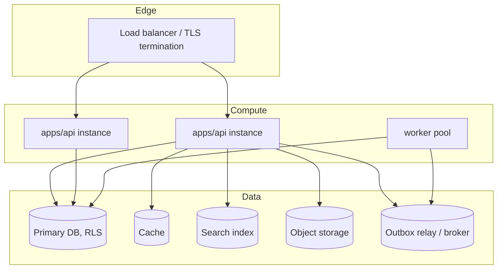

# Environment and deployment model

Status: draft, required before implementation starts (handoff §3.7).

## 1. Environments

| Environment | Purpose | Data | Notes |
|---|---|---|---|
| `local` | Developer machine | Synthetic fixtures only | Full stack runnable via `apps/api` + `apps/web` against a local DB |
| `ci` | Automated test execution | Ephemeral, created and destroyed per run | Runs unit/integration/contract/security suites from `docs/testing/quality-gates.md` |
| `staging` | Pre-production validation, pilot tenant rehearsal | Synthetic + anonymized-if-any | Mirrors production topology at smaller scale; used for import dry-runs (RISK-001) and E2E/load tests |
| `pilot` | First real tenant(s) (roadmap stage 8) | Real, minimal tenant set | Feature-flag gated; closest scrutiny before general availability |
| `production` | Live multi-tenant platform | Real | NFR-AVAIL-001 SLOs apply |

Every environment enforces the same tenant-isolation model (ADR-0002) — there is no "isolation off" mode, including in `local`/`ci`, so isolation bugs surface before staging.

## 2. Deployment unit and topology

Per ADR-0001, the deployable unit for MVP is `apps/api` (composition root hosting all `services-or-modules/*` in-process) plus a separate `worker` process (same codebase, async entrypoint) and `apps/web`. This keeps the option open to later split a module into its own deployable without changing its port/event contracts.

`apps/api` is stateless and horizontally scaled behind the load balancer; session state lives in the token, not in-process memory (ADR-0003), so any instance can serve any request for a given tenant.

## 3. Release process

- Migrations run forward-only in normal operation; every migration ships with a documented rollback or forward-fix note (NFR-MAINT-001, handoff §5 closing rule) — see `docs/data/migration-import-rollback.md`.
- Every roadmap stage ships behind a feature flag, is independently disableable, and includes its own migration, docs, and telemetry (roadmap.md closing note).
- MVP targets low-downtime rolling deploys; zero/low-downtime canary/blue-green is an industrial-tier goal (NFR-MAINT-001).

## 4. Observability baseline (applies to every environment above production's `local`)

Structured logs, metrics, and traces carry `correlation_id` and `tenant_id`, never PII (NFR-OBS-001, SEC-015). Alerts exist for: elevated `PERMISSION_DENIED`/`TENANT_MISMATCH` rate (possible probing), DLQ depth growth, integration `INTEGRATION_UNAVAILABLE` rate, and AI use-case cost/latency/kill-switch state (AI-012).

## 5. Disaster recovery

MVP target: RPO ≤ 24h, RTO ≤ 8h (recommended, not contractual — NFR-DR-001); industrial tier: RPO ≤ 15 min, RTO ≤ 2h. Backups are encrypted (SEC-016) and restore-tested on an agreed cadence — an untested backup is not treated as a valid recovery point (NFR §"дополнительные требования").

## 6. Open items

Concrete cloud/infra provider, database engine, broker product, and CI platform are implementation choices for Platform Foundation (roadmap stage 1) and are deliberately not fixed in this document; QST-016 (contractual RPO/RTO/SLA) must be resolved before any tenant-facing SLA commitment.
