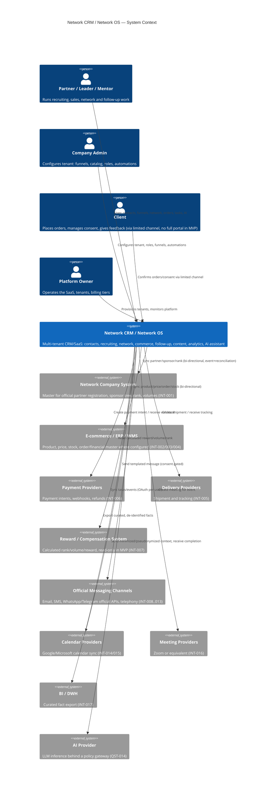
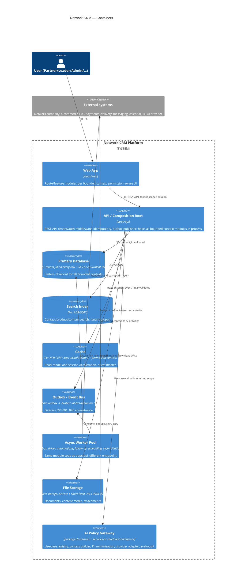
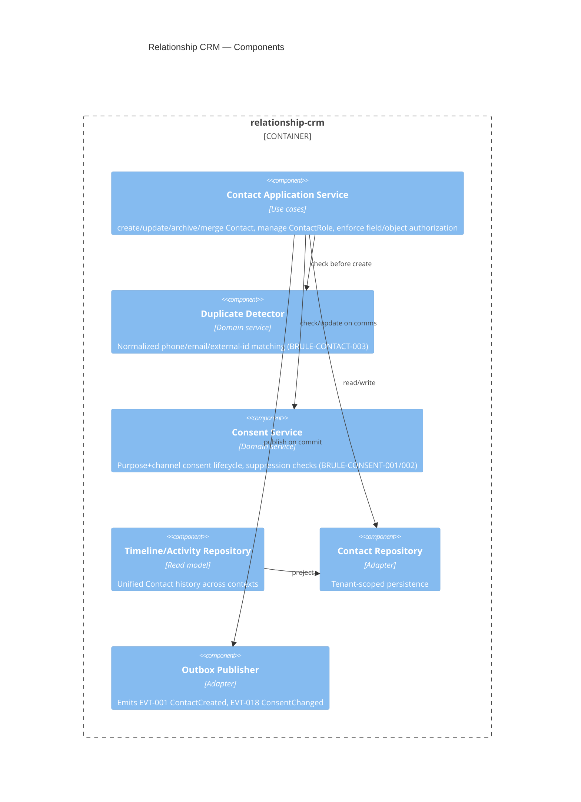
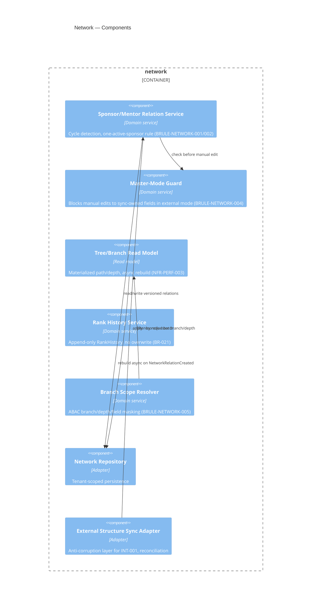

# System Context and Container/Component View (C4)

Status: draft, requires product-owner + architecture sign-off before implementation starts (per `docs/requirements/claude-code-handoff.md` §3.1). Traces to BR-001..BR-030 in `docs/requirements/business-requirements.md`.

## 1. Scope and starting architecture

Per ASM-013 and the handoff instruction, the platform starts as a **modular monolith**: one deployable backend (`apps/api`) composed of the bounded contexts under `services-or-modules/*`, communicating through in-process application ports and an asynchronous outbox/event bus — never direct cross-context table writes. Extraction of a module into an independently deployed service is allowed later, justified by measured load, independent release cadence, or risk isolation (see `docs/architecture/adr/0001-architecture-style.md`). This document is written so container boundaries survive that future extraction unchanged.

## 2. C4 Level 1 — System Context

The platform is never the master for official partner registration, compensation calculation, or accounting facts unless a tenant explicitly configures internal mode (QST-004, QST-005, QST-013). It is always the system of engagement/activity.

## 3. C4 Level 2 — Containers

## 4. C4 Level 3 — Component sketch (two representative modules)

### 4.1 `services-or-modules/relationship-crm`

### 4.2 `services-or-modules/network`

## 5. Cross-cutting concerns applied to every container

- Tenant context is resolved once at the API boundary and threaded through every call (SEC-003); no container trusts a tenant_id supplied only by the client without session/membership validation.
- Authorization is RBAC+ABAC evaluated in the application layer, not in the UI (SEC-004; see `docs/architecture/adr/0004-authorization-model.md`).
- Every mutating endpoint that creates, transitions state, pays, or replays a webhook carries an idempotency key (BR-020, BRULE-AUTO-001).
- Every container emits structured logs/metrics/traces with correlation ID and tenant ID, no PII (NFR-OBS-001, SEC-015).

## 6. Open items blocking industrial rollout

QST-004 (master per entity), QST-006/007 (sponsor change, branch visibility depth), QST-014 (AI provider/region) directly shape container boundaries above (`masterGuard`, `scopeSvc`, `aiGateway`) and must be resolved before those components leave interface/stub state, per handoff §8.
