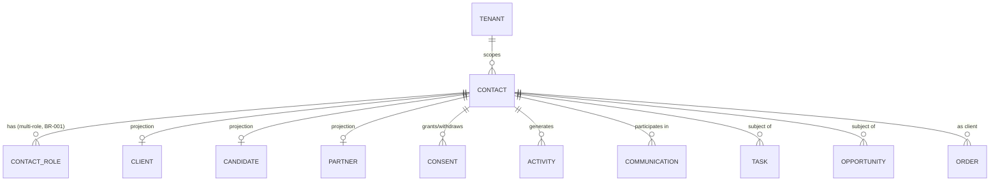
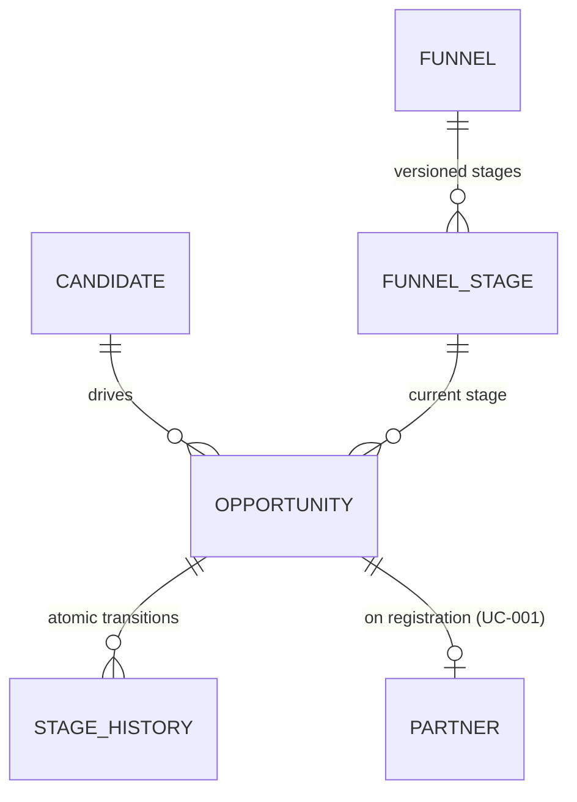
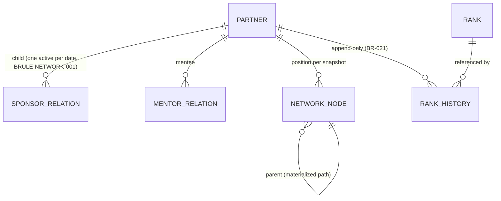
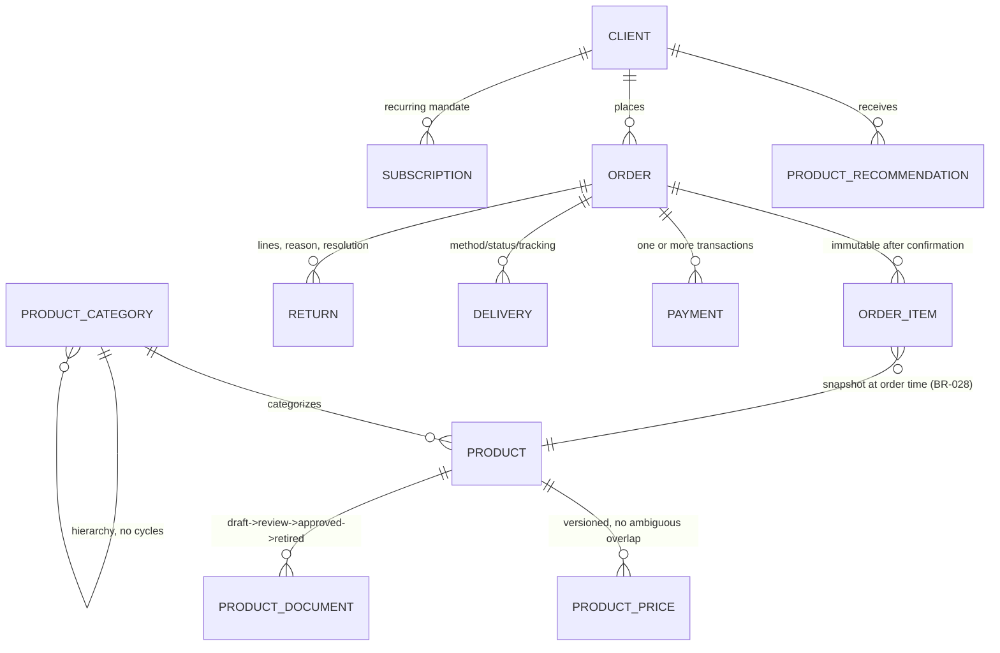
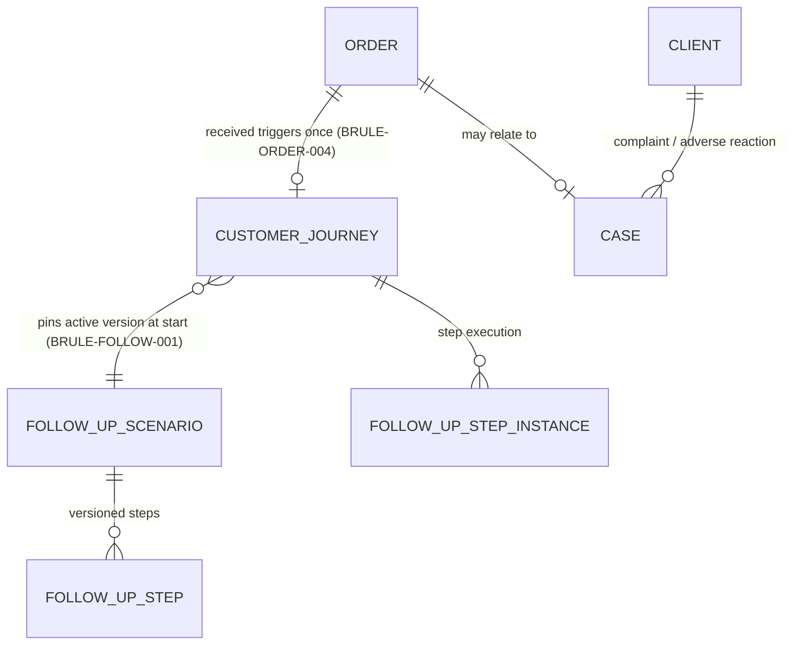
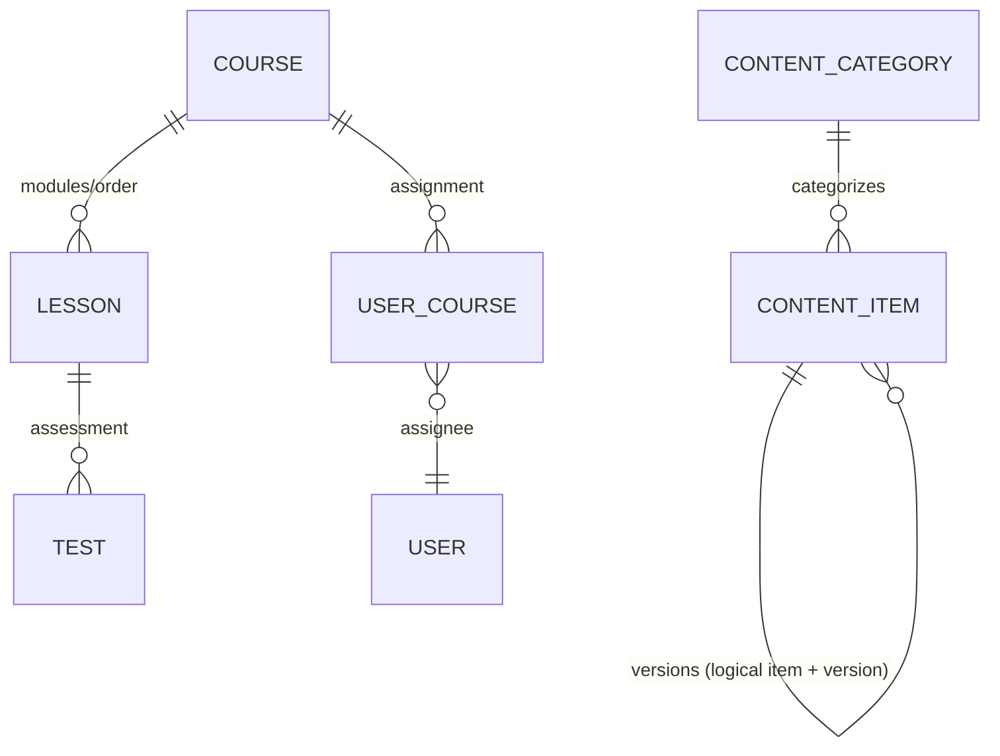
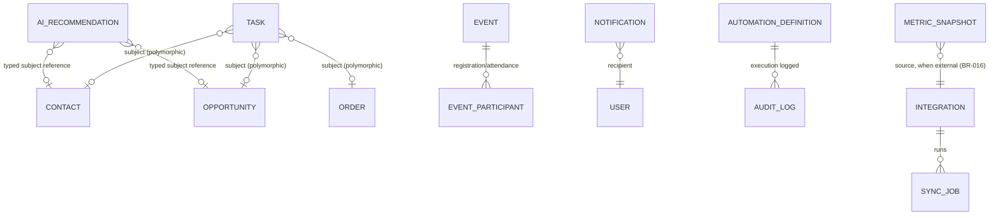

# Logical ERD

Status: draft logical model derived from `docs/requirements/data-dictionary.md` (ENT-001..054) and `docs/requirements/domain-model.md`. No physical DDL/types/indexes here — those are created only after ADR-0002 (tenancy/storage) is accepted and the open QSTs affecting each bounded context are resolved (handoff §3.4). Every table implied below carries the system fields `id, tenant_id, created_at, created_by, updated_at, version` (+`archived_at` where archivable) per data-dictionary.md preamble; omitted from the diagrams for readability.

## 1. Cross-context hub: Contact

Contact is the identity aggregate (domain-model.md §3): ContactRole, Consent, and unified history live inside its consistency boundary; role-specific projections (Client/Candidate/Partner) reference `contact_id` but own their own process state.

## 2. Recruitment

`FunnelStage` is immutable once activated except via a new `Funnel` version (ENT-022); `Opportunity.current_stage` always references a stage of the funnel version it was created against, `StageHistory` is append-only.

## 3. Network

`SponsorRelation` and `MentorRelation` are independent, versioned by `valid_from`/interval, never overlapping for the same child on the same date (BRULE-NETWORK-001, ASM-003). `NetworkNode` is a derived/snapshot read model when structure is internally computed, or a synced projection when externally mastered (see `docs/data/mastership-matrix.md`).

## 4. Commerce

`OrderItem` snapshots product name/price/discount/tax at confirmation time (BRULE-PRICE-001); later catalog changes never mutate a confirmed order's totals.

## 5. Customer Success

`Case` creation suspends incompatible marketing automation for the affected journey/client (BRULE-FOLLOW-002) — modeled as a cross-context event (`EVT-019 ComplaintCreated`) rather than a direct FK write into Customer Success from Commerce.

## 6. Content & Learning

## 7. Work Management, Engagement, Governance, Intelligence, Integration

`Task.subject` and `AIRecommendation.subject` are polymorphic typed references (data-dictionary.md ENT-018, ENT-047), not a single FK column — implemented as a discriminated reference (`subject_type` + `subject_id`), validated at the application layer per subject type, not enforced by a single DB foreign key.

## 8. Deletion / lifecycle semantics (applies across all diagrams)

Per domain-model.md §4: transactional and audit records are never deleted by ordinary CRUD. `Contact` archives; on a lawful erasure request PII is anonymized while relations are retained de-identified where required (SEC-012, BRULE-DELETE-001). Reference/config entities (Funnel, FollowUpScenario, ContentItem, AutomationDefinition) deactivate/retire rather than delete, preserving history for records that reference a specific version. Hard delete is restricted to a policy job that runs after the retention period and a legal-hold check (SEC-013). See `docs/data/migration-import-rollback.md` for the operational procedure.
