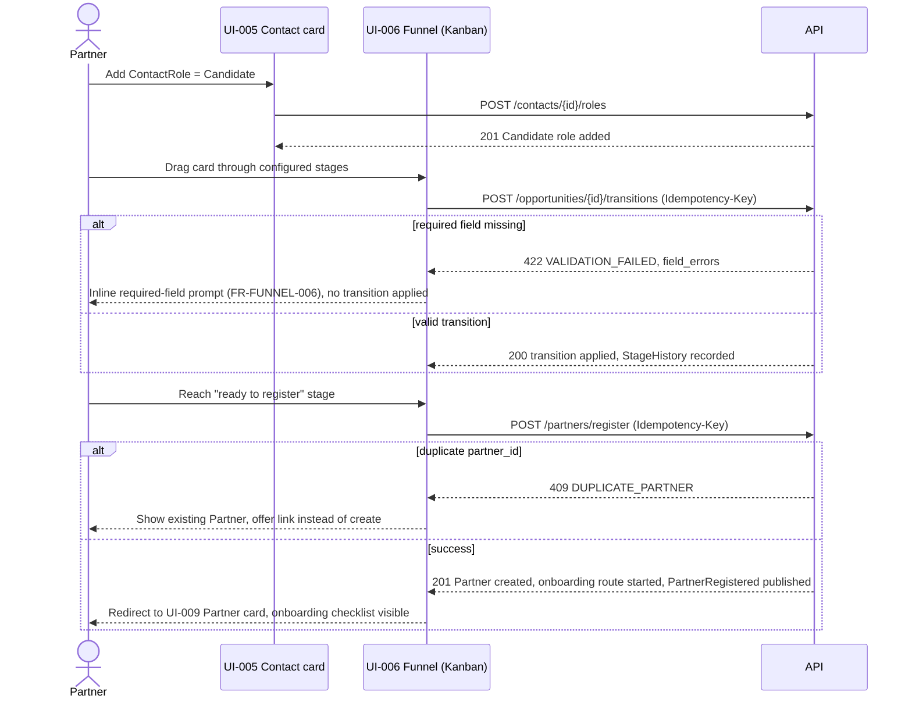
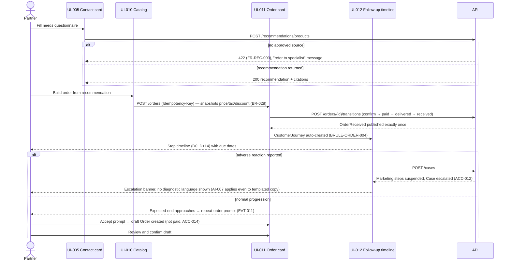
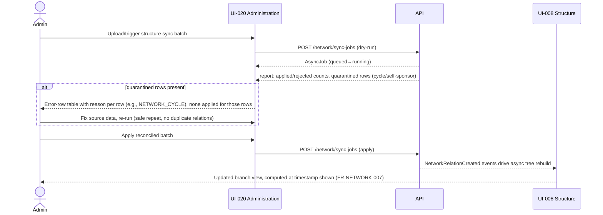
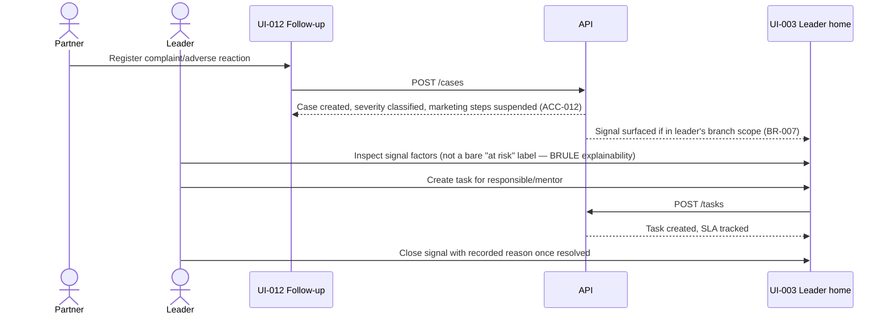

# Critical-flow wireframes

Status: draft, textual/sequence wireframes for the four sequential business processes in `docs/requirements/business-requirements.md` §7 (UC-001..UC-004), which are also the three MVP cross-cutting scenarios in `docs/requirements/mvp-scope.md` §1. Pixel-level wireframes are deferred to visual design; this document fixes screen sequence, state, and decision points so implementation and design agree on structure first (handoff §3.9).

## Flow 1 — UC-001 Contact → Partner (MVP scenario 1)

Screens: UI-005 Contact card → UI-006 Candidate funnel (Kanban) → transition dialog → UI-009 Partner card → onboarding route.

States to implement on the funnel screen: loading (stage fetch), empty (no candidates in view), permission-denied (stage/action not in role's scope), validation-error (missing required field), transient-error + retry (API-012-style network failure on transition), and a distinct **conflict** state for `INVALID_STAGE_TRANSITION`/`DUPLICATE_PARTNER` that is not the generic transient-error treatment (the user needs a different next action, not "try again").

## Flow 2 — UC-002 Client → Order → Follow-up → Repeat (MVP scenario 2)

Screens: UI-005 Contact card (needs) → UI-010 Catalog/recommendation → UI-011 Order card → UI-012 Follow-up timeline → repeat-order prompt.

States: an order transition attempted from an invalid current status must render as a **state-conflict** panel showing the current status and the valid next actions, not a generic error toast — this directly implements FR-ORDER-004's state machine being visible, not just enforced.

## Flow 3 — UC-003 Structure change (network sync/manual)

Screens: UI-020 Administration (sync job) → UI-008 Structure (reconciliation review) → node drawer.

## Flow 4 — UC-004 Complaint / adverse reaction (MVP scenario 3, leader-facing half)

Screens: UI-012 Follow-up (case creation) → UI-003 Home (leader signal) → UI-013 Task assignment.

## Cross-flow UI contract

Every screen in the four flows above renders the same six states (`docs/requirements/functional-requirements.md` §13 preamble): loading, empty, permission-denied, validation-error, transient-error+retry, and — specific to these flows — a **business-conflict** state (invalid transition, duplicate, cycle, price expired) that is visually and textually distinct from a technical transient error, because the recovery action differs (fix input / choose different action vs. retry).
