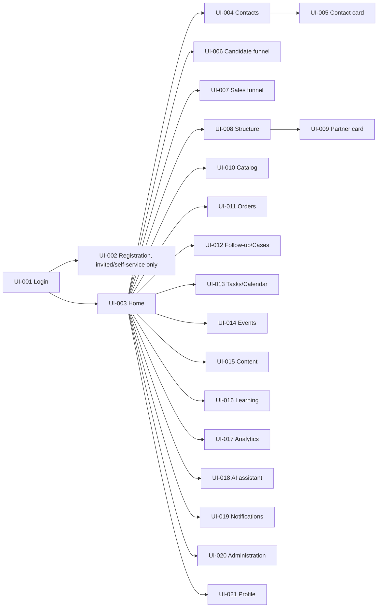

# UI information architecture

Status: draft, required before UI implementation (handoff §3.9). Source: `docs/requirements/functional-requirements.md` §13 (UI-001..021) and `docs/requirements/roles-and-permissions.md`. Every screen below must implement the six states required platform-wide: loading, empty, permission-denied, validation-error, transient-error, retry (functional-requirements.md §13 preamble).

## 1. Primary navigation (role-filtered)

Navigation items are computed per session from the PDP (ADR-0004), not hidden purely by CSS — an item the role cannot use is absent from the nav model returned to the client, not just visually hidden.

## 2. Nav visibility by role (default; tenant admin may narrow further, never widen beyond `docs/requirements/roles-and-permissions.md`)

| Nav item | Company admin | Leader | Mentor | Partner | Newcomer | Client | Content mgr | Trainer |
|---|---|---|---|---|---|---|---|---|
| Home | ✓ | ✓ | ✓ | ✓ | ✓ | — | ✓ | ✓ |
| Contacts | ✓ | ✓ (scoped) | ✓ (assigned) | ✓ (owned) | ✓ (owned, limited) | — | — | — |
| Recruiting funnel | ✓ | ✓ (scoped) | — | ✓ (owned) | — | — | — | — |
| Sales funnel / Orders | ✓ | ✓ (scoped, read) | ✓ (assigned, read) | ✓ (owned) | ✓ (owned, limited) | ✓ (self, confirm only) | — | — |
| Structure | ✓ | ✓ (branch) | ✓ (mentored) | ✓ (self/allowed) | ✓ (self) | — | — | ✓ (cohort, minimal) |
| Catalog | ✓ | ✓ | ✓ | ✓ | ✓ | ✓ (public/approved) | — | — |
| Follow-up / Cases | ✓ | ✓ (branch) | ✓ (assigned) | ✓ (owned) | — | — | — | — |
| Tasks / Calendar | ✓ | ✓ | ✓ | ✓ | ✓ | — | — | — |
| Events | ✓ | ✓ | ✓ | ✓ | ✓ | — | — | ✓ |
| Content / Knowledge | ✓ (config) | ✓ (use) | ✓ (use) | ✓ (use) | ✓ (assigned) | ✓ (public) | ✓ (CRUD/workflow) | ✓ (use) |
| Learning | ✓ (config) | ✓ (scoped read) | ✓ (assigned RU) | ✓ (self) | ✓ (self) | — | ✓ (linked read) | ✓ (CRUD) |
| Analytics | ✓ (tenant) | ✓ (branch) | ✓ (assigned) | ✓ (self) | ✓ (self) | — | ✓ (usage read) | ✓ (learning read) |
| AI assistant | ✓ | ✓ | ✓ | ✓ | limited | — | — | — |
| Notifications | ✓ | ✓ | ✓ | ✓ | ✓ | limited (service only) | ✓ | ✓ |
| Administration | ✓ | — | — | — | — | — | ✓ (content config) | ✓ (learning config) |
| Profile | ✓ | ✓ | ✓ | ✓ | ✓ | ✓ | ✓ | ✓ |

Client access is via a limited confirmation channel/cabinet, not the full nav (ASM-008 — full client portal out of MVP scope, `docs/requirements/mvp-scope.md` §3).

## 3. Screen-level notes carried into implementation

- **UI-005 Contact card**: must render summary, roles, timeline, in-flight processes, orders, consents, tasks, files as distinct panels — not a single flat form — because each panel has independent field-level authorization (roles-and-permissions.md §3).
- **UI-008 Structure**: lazy-loaded tree with date-snapshot control and branch/depth filters (FR-NETWORK-002); must never fetch the full tree eagerly (NFR-PERF-003).
- **UI-011 Orders**: status timeline is a first-class element, not a text field — mirrors the `Order` state machine (FR-ORDER-004) so an invalid transition is visibly disabled in the UI, while the server remains the actual authority (FR-CORE-001 — UI convenience never substitutes for server validation).
- **UI-018 AI assistant**: every suggestion surface shows source/citations and an explicit accept/edit/reject control (AI-005); it is never a silent auto-apply.
- **UI-020 Administration**: every critical config change shows an impact preview and versions the change (FR-ADMIN-002) before activation.

## 4. Accessibility and responsiveness baseline

WCAG 2.1 AA target for MVP critical flows; usable from 360px width upward; desktop/tablet/mobile web (NFR-UX-001, NFR-A11Y-001). RU is the first locale; all copy goes through an i18n layer from the start even though only one locale ships in MVP (NFR-I18N-001, QST-002 interim decision).
